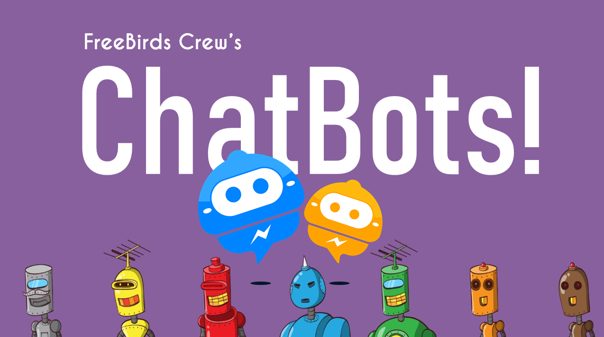

# AI_ChatBot_Python
AI ChatBot using Python Tensorflow and Natural Language Processing (NLP) along side TFLearn
Hey Guys!! Want to Learn about ChatBots? So the Solution is Here.

We Explain about these Topics in Our Tutorial Visit - Youtube -https://www.youtube.com/channel/UC4RZP6hNT5gMlWCm0NDzUWg?view_as=subscriber?sub_confirmation=1
1. What are ChatBots?
2. What ChatBots Can Do?
3. Architecture and Working of ChatBots
4. Core Processes of ChatBots
5. Use Cases of ChatBots
6. Top Healthcare ChatBots
7. Top Companies that Implement ChatBots in Their Business.
8. Top Platforms to Build ChatBots and Tools used in ChatBot Development.
9. Practical Work - Build One Contextual ChatBot Using Python, Tensorflow, and NLP.

It's a very Informative Session that discloses about ChatBots and Their Internal Working Architecture along with Programming.

This Session is useful for both Technical and Non-Technical Persons.

To get the Source Code, Follow me on Github -
Github - https://github.com/FreeBirdsCrew/AI_ChatBot_Python

Follow me on Instagram and Facebook to get Updates on Projects and Ideas that We are Working On !!
Instagram -  https://www.instagram.com/freebirdscrew

The More You Analyze, More You Get Insights from the Data.

***NUESTRO TRABAJO*** 
Grupo constituido por Karina Alem, María Gimena Binaghi, Florencia Bravo Corvalán y Laura Martínez Quijano

***Primer paso: correr el Contextual Chatbot en Colab***
Errores encontrados y sus soluciones:
*Error al no encontrar el archivo Untitled.png - Solucionado al importar el archivo con el siguiente codigo:
from google.colab import files
uploaded = files.upload()
*Error al no encontrar la librería tflearn - Solucionado instalando la libreria con el siguiente codigo: !pip install tflearn
*Error con la version de tensorflow <—— deprecated - Solucionado instalando una versión más reciente con el siguiente código: !pip install tensorflow2.5.0
*Error al no encontrar el archivo intents.json - Solucionado al importar el archivo con el siguiente codigo:
uploaded = files.upload()
*Error con la librería nltk al usarlo en nltk.word_tokenize - Solucionado incorporando previamente el siguiente codigo:
nltk.download('punkt')
from nltk import word_tokenize,sent_tokenize
*Error en el codigo reset_default_graph(). <—— deprecated - Solucionado con la actualizacion de la función:
tf.compat.v1.reset_default_graph()
*Error en la linea con el codigo "das" - Solucionado con # para anularla

***Segundo paso: correr el Chatterbot en Colab***
